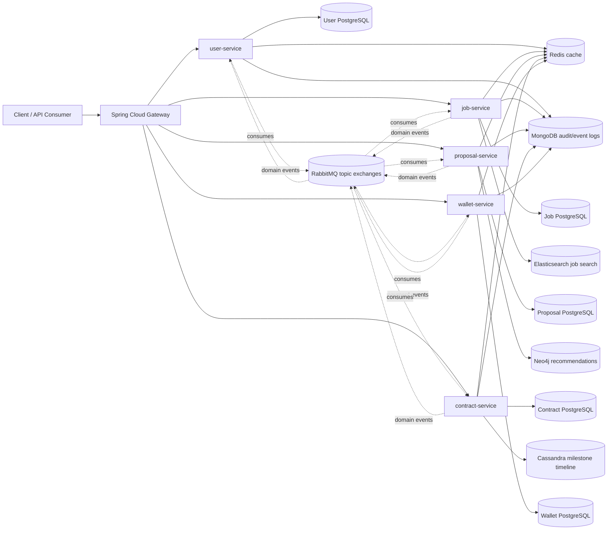
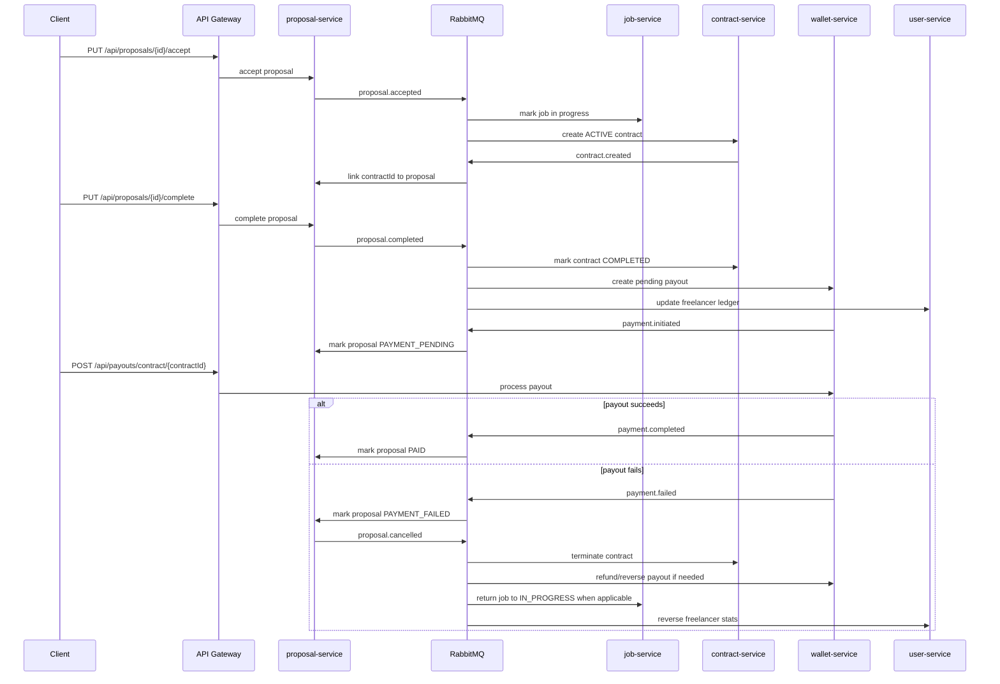

# Freelance Marketplace Platform


A distributed backend for a freelance marketplace, built as a portfolio-grade
microservices system with service-owned data, JWT-secured APIs, synchronous
read calls, asynchronous domain events, Redis caching, polyglot persistence,
Kubernetes manifests, and an observable runtime powered by Prometheus, Loki,
and Grafana.

The project models the full marketplace lifecycle: clients create jobs,
freelancers submit proposals with milestones, accepted proposals create
contracts, completed work triggers payouts, and failed payments run a
compensating saga that keeps proposals, contracts, jobs, wallet state, and
freelancer statistics consistent.

## Table Of Contents

- [Why This Project Exists](#why-this-project-exists)
- [System Highlights](#system-highlights)
- [Architecture](#architecture)
- [Services](#services)
- [Data Ownership](#data-ownership)
- [Communication Model](#communication-model)
- [Proposal Payment Saga](#proposal-payment-saga)
- [Security](#security)
- [Observability](#observability)
- [Design Patterns](#design-patterns)
- [Repository Structure](#repository-structure)
- [Getting Started](#getting-started)
- [API Overview](#api-overview)
- [Testing](#testing)
- [Kubernetes Deployment](#kubernetes-deployment)
- [Configuration Reference](#configuration-reference)
- [CI/CD](#cicd)
- [Roadmap](#roadmap)

## Why This Project Exists

Most marketplace demos stop at CRUD. This project was built to exercise the
harder parts of backend engineering:

- independently deployable services with clear ownership boundaries
- no direct cross-service database access in the Kubernetes deployment
- OpenFeign clients for read dependencies
- RabbitMQ topic exchanges for side effects and distributed workflows
- saga-based compensation for partial failures
- service-level caching and cache invalidation
- JWT authentication at the gateway plus service-level defense in depth
- multiple data stores chosen for different query shapes
- containerized local development and Kubernetes manifests
- metrics, logs, dashboards, health checks, and CI

The result is intentionally more than a classroom CRUD backend. It is a
compact distributed system that demonstrates the tradeoffs behind real
service-oriented applications.

## System Highlights

| Area | Implementation |
| --- | --- |
| Domain | Freelance marketplace: users, skills, jobs, proposals, milestones, contracts, payouts, promo codes |
| Backend | Java 25, Spring Boot 3.4.4, Spring MVC, Spring Security, Spring Data |
| Gateway | Spring Cloud Gateway with JWT validation and path-based routing |
| Sync communication | Spring Cloud OpenFeign with correlation ID propagation |
| Async communication | RabbitMQ topic exchanges, durable queues, retry, and DLQs |
| Persistence | PostgreSQL, MongoDB, Redis, Elasticsearch, Neo4j, Cassandra |
| Caching | Redis cache managers with service-scoped keys and targeted eviction |
| Observability | Spring Actuator, Micrometer, Prometheus, Loki, Grafana dashboards |
| Deployment | Docker Compose for local integration, Kubernetes manifests for cluster deployment |
| CI | GitHub Actions for workflow linting, Docker linting, Compose validation, Checkstyle, Maven builds, and image builds |

## Architecture



Every public request enters through the gateway. The gateway validates JWTs,
adds identity headers, ensures a correlation ID exists, and routes the request
to the owning service. Services own their write models and publish events for
state changes that other services need to react to.

## Services

| Module | Responsibility | Primary endpoints | Extra data stores |
| --- | --- | --- | --- |
| `api-gateway` | Single public entry point, JWT validation, correlation ID creation, path routing | `/api/auth/**`, `/api/users/**`, `/api/jobs/**`, `/api/proposals/**`, `/api/contracts/**`, `/api/payouts/**`, `/api/promo-codes/**` | None |
| `user-service` | Registration, login, profiles, roles, preferences, skills, freelancer stats, activity feeds | `/api/auth`, `/api/users`, `/api/skills` | MongoDB for auth/activity events, Redis for user/profile/report caches |
| `job-service` | Job posting lifecycle, requirements, attachments, rating, dashboard views, full-text search | `/api/jobs` | Elasticsearch for search, MongoDB for job events, Redis for cached searches/reports |
| `proposal-service` | Proposal CRUD, fee estimates, milestones, analytics, recommendations, saga state | `/api/proposals`, `/api/proposal-milestones` | Neo4j for recommendation graph, MongoDB for proposal events, Redis for analytics/search/detail caches |
| `contract-service` | Contract creation, status transitions, summaries, analytics, progress, milestone tracking | `/api/contracts` | Cassandra for milestone timelines, MongoDB for contract events, Redis for analytics/detail/search caches |
| `wallet-service` | Payouts, refunds, payout reversal, promo codes, platform revenue, fee analytics | `/api/payouts`, `/api/promo-codes`, `/api/payout-promos` | MongoDB for payout audit events, Redis for payout/report caches |
| `contracts` | Shared DTOs, Feign interfaces, and event records used across services | Internal Maven module | None |
| `security-common` | Shared JWT filter and authentication chain for downstream services | Internal Maven module | Uses service/user DB for token user validation |
| `event-common` | Shared event abstractions and event factory for MongoDB event logging | Internal Maven module | None |

## Data Ownership

The Kubernetes deployment follows database-per-service ownership for the
transactional PostgreSQL stores:

| Service | PostgreSQL database in Kubernetes |
| --- | --- |
| `user-service` | `freelancedb-users` |
| `job-service` | `freelancedb-jobs` |
| `proposal-service` | `freelancedb-proposals` |
| `contract-service` | `freelancedb-contracts` |
| `wallet-service` | `freelancedb-wallet` |

Cross-service references are represented as IDs, not JPA relationships across
service boundaries. Read dependencies go through Feign clients. Write side
effects go through RabbitMQ events.

The local `docker-compose.yaml` is a development convenience stack. It starts
one PostgreSQL container and wires the services to a shared local database so
the full system is easier to run on a laptop. The Kubernetes manifests are the
service-isolated deployment model.

### Polyglot Persistence

| Store | Used for |
| --- | --- |
| PostgreSQL | Transactional service-owned domain state |
| MongoDB | Observer-driven audit/event logs for user, job, proposal, contract, and payout activity |
| Redis | Read-heavy endpoint caching with explicit TTLs and eviction |
| Elasticsearch | Job full-text search and filtering |
| Neo4j | Freelancer/job interaction graph for recommendations |
| Cassandra | Time-ordered contract milestone timeline events |

## Communication Model

### Synchronous Reads With Feign

Services use OpenFeign when they need data immediately to finish the request.
Examples:

- `user-service` reads contract and payout summaries.
- `job-service` reads proposal summaries and active contract counts.
- `proposal-service` validates users, jobs, and contracts.
- `contract-service` enriches contract views with user and job data.
- `wallet-service` reads user, job, contract, and proposal data before payout operations.

Each service has a Feign correlation interceptor so `X-Correlation-ID` travels
across nested service calls.

### Asynchronous State Changes With RabbitMQ

State-changing side effects are published as events. The event contract lives
in `contracts/src/main/java/com/team26/freelance/contracts/events`, and routing
keys are centralized in `SagaTopics`.

| Exchange | Example routing keys |
| --- | --- |
| `user.events` | `user.registered`, `user.deactivated` |
| `job.events` | `job.status-changed`, `job.rated`, `job.closed` |
| `proposal.events` | `proposal.accepted`, `proposal.completed`, `proposal.cancelled`, `proposal.withdrawn` |
| `contract.events` | `contract.created`, `contract.status-changed`, `contract.cancelled` |
| `payment.events` | `payment.initiated`, `payment.completed`, `payment.failed`, `payment.refunded` |

Every listener queue is durable and has a dead-letter queue. Consumers use
Spring AMQP retry with `default-requeue-rejected=false`, so failed messages are
not silently lost after retries are exhausted.

## Proposal Payment Saga

The main distributed workflow starts in `proposal-service` and coordinates
`job-service`, `contract-service`, `wallet-service`, and `user-service`.



The saga also has a scheduled abandonment check in `proposal-service`: proposals
that remain in `PAYMENT_PENDING` beyond the configured threshold publish a
`payment.failed` compensation event.

## Security

Authentication is JWT-based.

- `user-service` owns registration and login.
- `api-gateway` validates bearer tokens at the public edge.
- Auth routes and health routes are public.
- Authenticated requests get `X-User-Id` and `X-User-Role` headers injected by the gateway.
- Downstream services keep `security-common` filters for defense in depth.
- Method-level authorization is used for sensitive proposal operations.

The shared `security-common` module implements JWT authentication as a chain of
handlers:

1. extract bearer token
2. validate token signature and expiration
3. extract claims
4. load the user
5. populate the Spring Security context

For public demos, replace the default development secret with a long random
base64 value.

## Observability

The services expose actuator health and Prometheus metrics. The Kubernetes
monitoring stack includes:

- Prometheus scraping `/actuator/prometheus` from all five domain services
- Loki for structured service logs
- Grafana datasource provisioning for Prometheus and Loki
- service dashboards for user, job, proposal, contract, and wallet
- Kubernetes readiness and liveness probes on app workloads
- correlation IDs propagated through gateway, Feign, logs, and RabbitMQ message headers

Useful local cluster ports:

| Component | Kubernetes service | Access |
| --- | --- | --- |
| Gateway | `api-gateway` in `freelance` | NodePort `30080` |
| Grafana | `grafana` in `monitoring` | NodePort `30030` |
| Prometheus | `prometheus` in `monitoring` | `kubectl port-forward svc/prometheus 9090:9090 -n monitoring` |
| Loki | `loki` in `monitoring` | Cluster-internal by default |

## Design Patterns

The codebase intentionally uses recognizable patterns where they clarify a
real concern:

| Pattern | Where | Why it matters |
| --- | --- | --- |
| Chain of Responsibility | `security-common/.../handler` | JWT authentication is decomposed into extraction, validation, claims, user loading, and context population |
| Singleton | `JwtConfigurationManager` | Shared JWT configuration is loaded once and reused |
| Observer | `EntityObserver`, `MongoEventLogger`, event subjects in each service | Domain actions produce MongoDB audit events without coupling controllers to logging details |
| Factory | `event-common/EventFactory` | Creates typed Mongo event documents from common event parameters |
| Adapter | `MongoDocumentAdapter`, `CassandraRowAdapter`, `Neo4jRecordAdapter`, object-array adapters | Converts infrastructure-specific shapes into service DTOs |
| Strategy | wallet refund strategies | Selects full payout, milestone-only, or no-reversal behavior based on refund rules |
| Builder | `ProposalDetailsDTOBuilder` | Builds rich proposal detail views from several inputs |

## Repository Structure

```text
.
|-- api-gateway/          # Spring Cloud Gateway entry point
|-- user-service/         # accounts, auth, profiles, skills, freelancer stats
|-- job-service/          # job posts, attachments, search, dashboards
|-- proposal-service/     # proposals, milestones, recommendations, saga state
|-- contract-service/     # contracts, progress, milestone timelines, analytics
|-- wallet-service/       # payouts, refunds, promo codes, revenue analytics
|-- contracts/            # shared DTOs, Feign clients, RabbitMQ event records
|-- security-common/      # reusable JWT security filter and auth handlers
|-- event-common/         # MongoDB event abstraction and factory
|-- k8s/                  # Kubernetes workloads, services, data stores, monitoring
|-- docs/                 # milestone specifications and implementation notes
|-- config/               # Checkstyle CI configuration
|-- docker-compose.yaml   # local integration stack
|-- saga_test.py          # gateway-level saga smoke/E2E script
`-- pom.xml               # Maven reactor aggregator
```

## Getting Started

### Prerequisites

- Java 25
- Maven 3.9+
- Docker and Docker Compose
- Optional: Kubernetes cluster, `kubectl`, and Minikube or Docker Desktop Kubernetes

### 1. Clone And Configure

```bash
git clone <your-repo-url>
cd Scalable-ACL03
```

Create a local environment file:

```bash
cp .env.example .env
```

On Windows PowerShell:

```powershell
Copy-Item .env.example .env
```

Set `JWT_SECRET` in `.env` to a base64-encoded secret. For local development,
you can generate one with:

```bash
openssl rand -base64 64
```

Or with PowerShell:

```powershell
[Convert]::ToBase64String((1..64 | ForEach-Object { Get-Random -Maximum 256 }))
```

### 2. Build The Java Modules

```bash
mvn clean package
```

To build without running tests:

```bash
mvn clean package -DskipTests
```

### 3. Run Locally With Docker Compose

```bash
docker compose up --build
```

The Compose stack exposes:

| Component | Local URL |
| --- | --- |
| API Gateway | `http://localhost:8080` |
| user-service | `http://localhost:8081` |
| job-service | `http://localhost:8082` |
| proposal-service | `http://localhost:8083` |
| contract-service | `http://localhost:8084` |
| wallet-service | `http://localhost:8085` |
| PostgreSQL | `localhost:5432` |
| MongoDB | `localhost:27017` |
| Redis | `localhost:6379` |
| Elasticsearch | `http://localhost:9200` |
| Neo4j Browser | `http://localhost:7474` |
| Cassandra | `localhost:9042` |

Health check through the gateway:

```bash
curl http://localhost:8080/actuator/health
```

Service health examples:

```bash
curl http://localhost:8080/api/users/health
curl http://localhost:8080/api/jobs/health
curl http://localhost:8080/api/proposals/health
curl http://localhost:8080/api/contracts/health
curl http://localhost:8080/api/payouts/health
```

### 4. Authenticate

Register a client:

```bash
curl -X POST http://localhost:8080/api/auth/register \
  -H "Content-Type: application/json" \
  -d '{
    "name": "Portfolio Client",
    "email": "client@example.com",
    "password": "Password123!",
    "phone": "+201000000001",
    "role": "CLIENT"
  }'
```

Register a freelancer:

```bash
curl -X POST http://localhost:8080/api/auth/register \
  -H "Content-Type: application/json" \
  -d '{
    "name": "Portfolio Freelancer",
    "email": "freelancer@example.com",
    "password": "Password123!",
    "phone": "+201000000002",
    "role": "FREELANCER"
  }'
```

Login and copy the returned `token`:

```bash
curl -X POST http://localhost:8080/api/auth/login \
  -H "Content-Type: application/json" \
  -d '{
    "email": "client@example.com",
    "password": "Password123!"
  }'
```

Use the token:

```bash
curl http://localhost:8080/api/users/1/profile \
  -H "Authorization: Bearer <token>"
```

## API Overview

This is not a full OpenAPI document, but it shows the main service-level API
surface. The gateway currently routes the main path families listed in the
services table above. Docker Compose also exposes direct service ports, which
are useful for service endpoints that exist in controllers but are not yet
listed in gateway route predicates, such as `/api/skills/**`,
`/api/proposal-milestones/**`, and `/api/payout-promos/**`.

### Authentication And Users

| Method | Path | Purpose |
| --- | --- | --- |
| `POST` | `/api/auth/register` | Register a client, freelancer, or admin |
| `POST` | `/api/auth/login` | Issue a JWT |
| `GET` | `/api/users/{id}` | Read a provider/user DTO |
| `GET` | `/api/users/{id}/profile` | Read a profile with skills and marketplace context |
| `GET` | `/api/users/{id}/activity` | Read activity feed |
| `PUT` | `/api/users/{id}/preferences` | Update JSON preferences |
| `GET` | `/api/users/reports/top-freelancers` | Top freelancer report by date range |
| `GET` | `/api/users/{id}/contract-summary` | Contract summary via contract-service |
| `POST` | `/api/users/{userId}/skills` | Add a skill |
| `PUT` | `/api/users/{userId}/skills/{skillId}/primary` | Mark primary skill |

### Jobs

| Method | Path | Purpose |
| --- | --- | --- |
| `POST` | `/api/jobs` | Create a job |
| `GET` | `/api/jobs/search` | Search by status and budget |
| `GET` | `/api/jobs/search/full-text` | Elasticsearch-backed full-text search |
| `GET` | `/api/jobs/{id}/proposal-summary` | Proposal summary via proposal-service |
| `GET` | `/api/jobs/{id}/dashboard` | Job dashboard view |
| `PUT` | `/api/jobs/{id}/close` | Close a job and trigger downstream proposal changes |
| `POST` | `/api/jobs/{id}/rate` | Rate a completed job/client interaction |
| `POST` | `/api/jobs/{jobId}/attachments` | Add job attachment metadata |
| `PUT` | `/api/jobs/{jobId}/attachments/{attachmentId}/verify` | Verify an attachment |

### Proposals And Milestones

| Method | Path | Purpose |
| --- | --- | --- |
| `POST` | `/api/proposals` | Create a proposal |
| `POST` | `/api/proposals/estimate` | Estimate platform fee from bid and duration |
| `GET` | `/api/proposals/search` | Search proposals by status/date |
| `GET` | `/api/proposals/analytics` | Proposal analytics by date range |
| `GET` | `/api/proposals/analytics/dashboard` | Aggregated analytics dashboard |
| `GET` | `/api/proposals/recommendations` | Neo4j-backed job recommendations |
| `PUT` | `/api/proposals/{id}/accept` | Accept proposal and publish `proposal.accepted` |
| `PUT` | `/api/proposals/{id}/complete` | Complete work and trigger payout saga |
| `PUT` | `/api/proposals/{id}/withdraw` | Withdraw proposal |
| `GET` | `/api/proposals/{id}/details` | Rich proposal detail view |
| `POST` | `/api/proposals/{id}/record-interaction` | Record graph interaction |
| `POST` | `/api/proposal-milestones/proposal/{id}` | Add proposal milestone |

### Contracts

| Method | Path | Purpose |
| --- | --- | --- |
| `POST` | `/api/contracts` | Create a contract |
| `GET` | `/api/contracts/search` | Search by amount and status |
| `GET` | `/api/contracts/analytics` | Contract analytics by date range |
| `GET` | `/api/contracts/history` | Contract history report |
| `GET` | `/api/contracts/user/{userId}/summary` | User contract summary |
| `GET` | `/api/contracts/proposal/{proposalId}/active` | Active contract lookup for saga pre-checks |
| `PUT` | `/api/contracts/{contractId}/progress` | Update progress metadata |
| `POST` | `/api/contracts/{id}/milestones/track` | Write milestone timeline event to Cassandra |
| `GET` | `/api/contracts/{id}/milestones/timeline` | Read milestone timeline |
| `GET` | `/api/contracts/stalled` | Detect stalled contracts |
| `GET` | `/api/contracts/freelancer/{freelancerId}/summary` | Freelancer performance summary |

### Wallet, Payouts, And Promo Codes

| Method | Path | Purpose |
| --- | --- | --- |
| `POST` | `/api/payouts` | Create payout |
| `POST` | `/api/payouts/contract/{contractId}` | Process payout for a contract |
| `GET` | `/api/payouts/search` | Search payouts by status/date |
| `PUT` | `/api/payouts/{id}/refund` | Refund payout |
| `PUT` | `/api/payouts/{id}/retry` | Retry failed payout |
| `POST` | `/api/payouts/{id}/reverse-milestone` | Reverse payout using selected refund strategy |
| `GET` | `/api/payouts/{id}/details` | Payout detail view with cross-service enrichment |
| `GET` | `/api/payouts/freelancer/{freelancerId}/summary` | Freelancer payout summary |
| `GET` | `/api/payouts/freelancer/{freelancerId}/total` | Completed payout total for a date range |
| `GET` | `/api/payouts/reports/revenue` | Platform revenue report |
| `GET` | `/api/payouts/analytics/methods` | Payout method breakdown |
| `GET` | `/api/payouts/analytics/category` | Platform fee analytics by job category |
| `POST` | `/api/promo-codes` | Create promo code |
| `POST` | `/api/payouts/{payoutId}/promos/{promoCodeId}` | Apply promo code to payout |

## Testing

Run all Maven tests:

```bash
mvn test
```

Run tests for a single service:

```bash
mvn -f wallet-service/pom.xml test
mvn -f contract-service/pom.xml test
mvn -f user-service/pom.xml test
```

The test suite includes unit tests for:

- event factory behavior
- RabbitMQ topology declarations
- event publishers and consumers
- user deactivation and proposal event reactions
- contract read endpoints and saga consumer paths
- wallet payout processing, refund behavior, promo code repository behavior, and saga E2E logic

There is also a gateway-level saga smoke script:

```bash
python saga_test.py --base http://localhost:30080 --scenario all
```

The script exercises:

- Scenario A: accept proposal, complete work, process payout successfully
- Scenario B: payout failure and compensation
- Scenario C: completion pre-check failure with no side effects

## Kubernetes Deployment

The `k8s/` folder contains manifests for:

- namespaces: `freelance`, `monitoring`
- secrets and configmaps
- internal services
- PostgreSQL StatefulSets per domain service
- MongoDB, Redis, RabbitMQ, Elasticsearch, Neo4j, Cassandra
- app deployments for all five services
- API gateway NodePort service
- Prometheus, Loki, and Grafana

The app deployments use `imagePullPolicy: Never`, so images must be available
inside the Kubernetes node runtime.

For Minikube, either build inside the Minikube Docker environment or load the
images after building:

```bash
docker compose build

minikube image load user-service:latest
minikube image load job-service:latest
minikube image load proposal-service:latest
minikube image load contract-service:latest
minikube image load wallet-service:latest
minikube image load api-gateway:latest
```

Apply manifests in explicit groups:

```bash
kubectl apply -f k8s/namespaces/namespace.yaml -f k8s/namespaces/monitoring-namespace.yaml
kubectl apply -f k8s/secrets
kubectl apply -f k8s/configmaps
kubectl apply -f k8s/pvcs
kubectl apply -f k8s/services
kubectl apply -f k8s/statefulsets
kubectl apply -f k8s/deployments
kubectl apply -f k8s/api-gateway
kubectl apply -f k8s/monitoring/loki
kubectl apply -f k8s/monitoring/prometheus
kubectl apply -f k8s/monitoring/grafana
```

Check rollout:

```bash
kubectl get pods -n freelance
kubectl get pods -n monitoring

kubectl rollout status deployment/user-service -n freelance
kubectl rollout status deployment/job-service -n freelance
kubectl rollout status deployment/proposal-service -n freelance
kubectl rollout status deployment/contract-service -n freelance
kubectl rollout status deployment/wallet-service -n freelance
kubectl rollout status deployment/api-gateway -n freelance
```

Access the gateway:

```bash
curl http://$(minikube ip):30080/actuator/health
```

Access Grafana:

```text
http://<minikube-ip>:30030
```

Access Prometheus with port-forwarding:

```bash
kubectl port-forward svc/prometheus 9090:9090 -n monitoring
```

For detailed operational notes, see `k8s/AGENT.md`.

## Configuration Reference

Common environment variables:

| Variable | Purpose |
| --- | --- |
| `JWT_SECRET` | Shared base64 JWT signing secret |
| `JWT_EXPIRATION` | Token lifetime in milliseconds |
| `SPRING_DATASOURCE_URL` | Service PostgreSQL JDBC URL |
| `SPRING_DATASOURCE_USERNAME` | PostgreSQL username |
| `SPRING_DATASOURCE_PASSWORD` | PostgreSQL password |
| `SPRING_DATA_MONGODB_URI` | MongoDB URI |
| `SPRING_DATA_REDIS_HOST` | Redis host |
| `SPRING_DATA_REDIS_PORT` | Redis port |
| `SPRING_DATA_REDIS_PASSWORD` / `SPRING_REDIS_PASSWORD` | Redis password |
| `SPRING_RABBITMQ_HOST` | RabbitMQ host |
| `SPRING_RABBITMQ_PORT` | RabbitMQ AMQP port |
| `FEIGN_USER_SERVICE_URL` | Internal user-service URL |
| `FEIGN_JOB_SERVICE_URL` | Internal job-service URL |
| `FEIGN_PROPOSAL_SERVICE_URL` | Internal proposal-service URL |
| `FEIGN_CONTRACT_SERVICE_URL` | Internal contract-service URL |
| `FEIGN_WALLET_SERVICE_URL` | Internal wallet-service URL |
| `LOKI_URL` | Loki push endpoint |
| `CACHE_TTL_DETAIL` | Detail cache TTL |
| `CACHE_TTL_SEARCH` | Search cache TTL |
| `CACHE_TTL_DASHBOARD` | Dashboard/report cache TTL |
| `CACHE_TTL_ACTIVITY` | Activity cache TTL |

Specialized variables:

| Variable | Used by | Purpose |
| --- | --- | --- |
| `SPRING_ELASTICSEARCH_URIS` | `job-service` | Elasticsearch endpoint |
| `NEO4J_URI` | `proposal-service` | Neo4j Bolt URI |
| `NEO4J_USERNAME` | `proposal-service` | Neo4j username |
| `NEO4J_PASSWORD` | `proposal-service` | Neo4j password |
| `SPRING_CASSANDRA_CONTACT_POINTS` | `contract-service`, `wallet-service` | Cassandra contact point |
| `SPRING_CASSANDRA_KEYSPACE_NAME` | `contract-service`, `wallet-service` | Cassandra keyspace |
| `SAGA_PAYOUT_ABANDON_AFTER` | `proposal-service` | Duration before pending payouts trigger compensation |

## CI/CD

The GitHub Actions workflow performs:

- workflow linting with `actionlint`
- Dockerfile linting with Hadolint
- Docker Compose validation
- Checkstyle across Java service modules
- Maven package build
- Docker image builds for the five domain services
- GHCR push on `main`

The workflow lives in `.github/workflows/ci.yml`.

## Roadmap

Useful next improvements for a public deployment:

- Add OpenAPI/Swagger aggregation at the gateway.
- Add Testcontainers integration tests for RabbitMQ and all persistence adapters.
- Replace local NodePorts with Ingress for a cleaner cluster entry point.
- Add Resilience4j circuit breakers around Feign clients.
- Add outbox tables for stronger event publication guarantees.
- Add per-service database migrations with Flyway or Liquibase.
- Add secret management for non-development Kubernetes environments.
